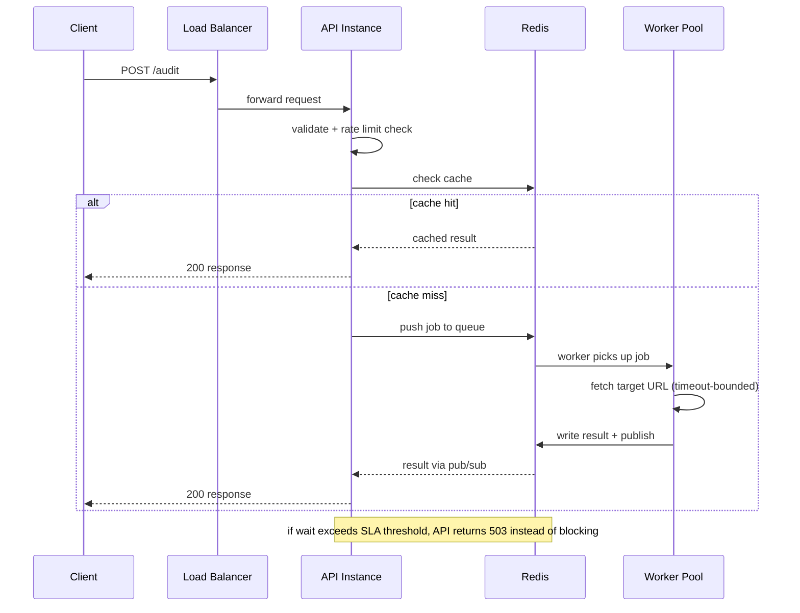

# Page Pulse — Architecture for Scale

Design for handling 10,000 audits/day with bursts of 500 concurrent requests, under a customer-facing response-time SLA.

## 1. Architecture Overview

**Core decision:** keep the client-facing API synchronous (same `POST /audit` contract as the current build), but insert a bounded queue + worker pool between the API and the actual URL-fetching logic. This absorbs bursts without changing what the client experiences, and lets the API return a fast, explicit `503` when the system is genuinely at capacity rather than making a client wait indefinitely.

### Components
- **Load balancer** — routes traffic across a fleet of stateless API instances
- **API instances** (FastAPI, same app as the current build) — validate input, check rate limit, check cache. Cache hit → respond immediately. Cache miss → enqueue a job, wait briefly on a result channel, respond when the worker finishes (or time out with `503` if it's taking too long)
- **Worker pool** — separate, independently-scaled processes consuming jobs from the queue with bounded concurrency (the distributed equivalent of the current build's in-process semaphore)
- **Redis** — the only stateful component: cache, rate-limit counters, job queue (Redis Streams), and job-result pub/sub
- **Monitoring/alerting** — watches latency, queue depth, error rate

### Data flow

### Where state lives
Entirely in Redis. API and worker instances are stateless — any instance can crash and restart without data loss, aside from in-flight requests that never reached the queue.

## 2. Technology Decision Record

| Decision | Chosen | Rejected alternative | Why |
|---|---|---|---|
| Queue | Redis Streams | SQS / RabbitMQ | Reuses existing Redis infra (cache + rate limiter already there); avoids a second stateful system to operate. SQS becomes the better call at much higher scale, where its stronger durability guarantees start to matter more than the operational simplicity of reusing Redis. |
| Redis hosting | Managed (Redis Cloud / ElastiCache) | Self-hosted | Patching, failover, and backups aren't worth operating in-house at this traffic level. |
| Scaling model | Horizontal (stateless instances) | Vertical (bigger single instance) | A single instance is a single point of failure and has a hard concurrency ceiling; horizontal scaling is the only way to genuinely absorb a 500-request burst. |
| Client contract | Synchronous with bounded wait + backpressure | Full async job/polling API | Preserves the existing `POST /audit` → immediate-response contract. Full async (job ID + polling/webhook) is the more correct approach at much larger scale (e.g. 1M/day), where decoupling the SLA from backend processing time becomes necessary — not justified yet at 10k/day. |

## 3. Failure Mode Analysis

| Failure mode | Why it's likely | Mitigation |
|---|---|---|
| Redis becomes slow/unavailable | It's the single shared dependency for cache, queue, and rate limiting — its failure cascades everywhere at once | Managed Redis with automatic failover/replicas; API fails *open* on cache reads (skip cache rather than error the request) but fails *closed* on rate limiting (safer to over-restrict than let abuse through); alerting on Redis latency/connection errors |
| Queue backlog grows during a sustained burst | 500 concurrent requests can arrive faster than workers can drain them | Cap queue depth — reject new requests fast with `503` once exceeded, rather than accepting and making them wait past the SLA; autoscale worker count using queue depth as the trigger metric |
| A slow/unresponsive third-party site monopolizes workers | Many clients auditing the same broken domain could exhaust the worker pool even at normal total request volume | Per-target-domain concurrency limits (separate from per-client rate limiting); reuse existing per-fetch timeouts; dead-letter/expiry so a permanently broken domain isn't retried indefinitely |

## 4. Observability & Rollback

**Metrics:** p50/p95/p99 response time (the actual SLA metric), queue depth over time, worker utilization, cache hit ratio, error rate broken out by type (429 / 500 / timeout).

**Logging:** extend the existing structured logs (request ID, from the current build) with a job ID that threads through the queue and worker, so one request's full lifecycle is traceable end-to-end.

**Alerting:** p95 latency breaching the SLA for a sustained window; queue depth above threshold; error-rate spike; Redis connection failures.

**Rollback:** stateless API/worker instances mean rollback is just redeploying the previous container image — no data migration to reverse. Use canary or blue-green deploys (shift a small percentage of traffic to the new version first); trigger automated rollback if latency/error alerts fire within a few minutes of a new deploy.